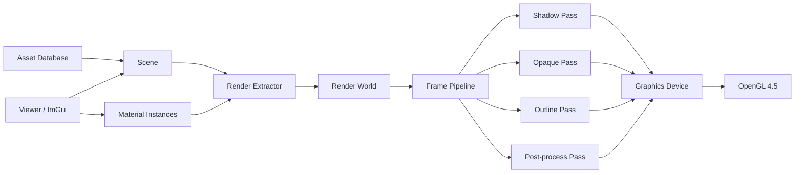

# StylizedRenderer 项目意见书

> 项目定位：以 OpenGL 为图形后端、以三渲二角色渲染为首个产品目标的可维护、可扩展实时渲染框架。

## 1. 文档信息

| 项目 | 内容 |
|---|---|
| 项目名称 | StylizedRenderer |
| 项目类型 | 实时渲染框架与风格化角色查看器 |
| 主要语言 | C++20、GLSL |
| 首个图形后端 | OpenGL 4.5 Core |
| 构建系统 | CMake |
| 首个平台 | Windows x64 |
| 首个产品 | Stylized Viewer |
| 核心方向 | NPR、角色渲染、渲染架构、资产管线、调试工具 |
| 文档状态 | 初始项目章程 |

本文档用于确定项目边界、架构原则、设计目标、阶段计划和验收标准。实现过程中如果需要偏离本文档，应记录 Architecture Decision Record（ADR），说明背景、选择、替代方案和后果。

---

## 2. 执行摘要

现有 OpenGL 学习项目已经覆盖模型加载、阴影、HDR、Bloom、延迟渲染、SSAO、PBR 和 IBL。下一阶段的主要学习价值不再来自继续增加孤立的图形示例，而来自以下问题：

1. 如何管理 GPU 资源的生命周期和所有权；
2. 如何分离场景数据、渲染数据与图形 API；
3. 如何组织多个 Render Pass；
4. 如何建立材质、Shader、资产与编辑工具之间的边界；
5. 如何让新功能以增加模块为主，而不是持续修改核心代码；
6. 如何通过测试、调试视图、性能指标和文档证明工程质量。

因此，StylizedRenderer 不以“完整游戏引擎”为目标，而以“渲染框架 + 三渲二角色查看器”为目标。项目应当做到：

- 第一阶段能够快速得到可见画面；
- 中期形成清晰、稳定的渲染架构；
- 后期通过 MToon、角色动画和多种描边方案体现技术深度；
- 最终能够作为作品集项目、技术演示和后续图形实验平台。

---

## 3. 项目定位与边界

### 3.1 项目定位

StylizedRenderer 是一个专注实时风格化渲染的个人图形项目。它包含两部分：

1. **Engine Library**：窗口之上的渲染基础设施、GPU 资源、场景、资产、材质和渲染管线；
2. **Stylized Viewer**：用于加载角色、调节材质、切换渲染功能、播放动画和输出截图的桌面应用。

项目强调“可被第二个应用复用”，但不追求覆盖完整游戏开发流程。

### 3.2 第一版必须解决的问题

- 正确加载 glTF/GLB 静态模型；
- 正确管理 Mesh、Texture、Shader、Framebuffer 等 GPU 资源；
- 支持方向光、阴影和基础环境光；
- 支持可调节的三渲二材质；
- 支持世界空间和屏幕空间描边；
- 支持 ImGui 材质检查器和渲染调试视图；
- 支持 Shader 热重载；
- 支持场景和材质参数保存；
- 支持截图与基础性能统计。

### 3.3 暂不纳入第一版

- Vulkan、Direct3D、Metal 后端；
- 完整 ECS；
- 物理、音频、网络和脚本系统；
- 完整关卡编辑器；
- 节点式材质编辑器；
- 通用 Render Graph；
- 开放世界、地形和大规模流式加载；
- 自定义模型文件格式；
- 自研窗口、图片解码和模型解析库。

这些内容不是永久禁止，而是必须等实际需求证明其必要性后再加入。

---

## 4. 设计目标

### 4.1 可维护性目标

1. 模块职责单一，依赖方向清晰；
2. OpenGL 调用集中在 `graphics` 层；
3. GPU 对象使用 RAII，不暴露不明确的所有权；
4. 禁止在渲染热路径中随意分配堆内存；
5. Shader、材质和纹理错误能够定位到具体资产；
6. 每个公共模块具有简短的使用说明；
7. 重大设计决策通过 ADR 记录；
8. Debug 构建默认开启 OpenGL Debug Callback 和断言；
9. 核心数据结构可以独立测试，不依赖窗口；
10. 每个里程碑都保持可构建、可运行。

### 4.2 可扩展性目标

框架应支持以下扩展，而不需要修改无关模块：

- 增加新的 Render Pass；
- 增加新的 Material Template；
- 增加新的后处理效果；
- 增加新的资产导入器；
- 增加新的场景组件；
- 增加新的 Viewer 或测试应用；
- 将来增加新的图形后端时，上层场景和材质接口无需整体重写。

“可扩展”不等于为所有未来需求预先设计。第一版只实现 OpenGL，但必须保持上层不依赖裸 `GLuint`。

### 4.3 技术展示目标

项目最终应能够体现以下能力：

- 现代 C++ 资源管理与移动语义；
- OpenGL 状态、同步和调试能力；
- 多 Pass 实时渲染；
- Shadow Mapping 与阴影稳定性处理；
- HDR、线性色彩空间和后处理；
- glTF 场景与材质导入；
- NPR 光照模型；
- MToon 风格材质；
- 反向外壳与屏幕空间描边；
- 骨骼蒙皮、Morph Target 和角色表情；
- Shader 变体与热重载；
- CPU/GPU 性能分析；
- 自动化测试和图像回归测试；
- 面向艺术调参的工具设计。

---

## 5. 总体架构



### 5.1 分层原则

依赖只能大致沿以下方向流动：

```text
apps
  ↓
editor / viewer
  ↓
scene + asset + renderer
  ↓
material + graphics
  ↓
core + platform
```

约束：

- `core` 不依赖 OpenGL；
- `scene` 不直接调用 OpenGL；
- `asset` 负责导入和转换，不负责每帧绘制；
- `graphics` 不理解 Entity、角色或 MToon；
- `renderer` 只消费提取后的 `RenderWorld`；
- `apps` 负责组合模块，不承载底层算法。

### 5.2 建议目录

```text
StylizedRenderer/
├── CMakeLists.txt
├── CMakePresets.json
├── README.md
├── PROJECT_PROPOSAL.md
├── LICENSE
├── cmake/
├── docs/
│   ├── architecture/
│   ├── adr/
│   ├── assets/
│   └── screenshots/
├── external/
├── assets/
│   ├── models/
│   ├── textures/
│   ├── shaders/
│   ├── environments/
│   └── scenes/
├── apps/
│   ├── viewer/
│   ├── sandbox/
│   └── tests/
├── engine/
│   ├── core/
│   ├── platform/
│   ├── graphics/
│   ├── material/
│   ├── asset/
│   ├── scene/
│   ├── renderer/
│   └── debug/
└── tests/
    ├── unit/
    ├── integration/
    └── golden/
```

---

## 6. 模块设计

### 6.1 Core

职责：

- 日志；
- 断言；
- 时间；
- 文件路径；
- 基础 Handle；
- Scope Guard；
- 配置；
- 事件和输入数据类型。

不应包含：

- OpenGL 头文件；
- Scene、Material 等上层概念；
- 全局可变单例。

建议统一基本类型和句柄：

```cpp
template<class Tag>
struct Handle {
    uint32_t index = invalidIndex;
    uint32_t generation = 0;

    [[nodiscard]] bool valid() const noexcept;
};
```

Generation 可以避免资源删除后旧 Handle 指向新对象。

### 6.2 Platform

职责：

- Window；
- 输入采集；
- OpenGL Context；
- 文件对话框；
- 平台相关路径；
- 高精度计时接口。

GLFW 细节不应泄漏到 Viewer 之外。窗口回调转换为项目自己的事件或输入状态。

### 6.3 Graphics

这是唯一允许直接使用 OpenGL API 的主要模块。

建议对象：

- `GraphicsDevice`
- `Buffer`
- `Texture`
- `Sampler`
- `ShaderModule`
- `GraphicsPipeline`
- `Framebuffer`
- `RenderTarget`
- `GpuQuery`
- `CommandContext`

第一版不设计完整跨 API RHI，但使用描述符创建资源：

```cpp
struct TextureDesc {
    uint32_t width;
    uint32_t height;
    TextureFormat format;
    TextureUsage usage;
    uint32_t mipLevels;
    std::string debugName;
};

TextureHandle createTexture(const TextureDesc& desc);
```

上层不得保存裸 OpenGL ID。Debug 构建为 GPU 对象设置可读标签，方便 RenderDoc 和 OpenGL 调试信息定位。

#### GPU 资源所有权

- GPU Resource Pool 是资源的实际拥有者；
- Handle 是非拥有引用；
- Asset 可以拥有或引用 GPU Handle；
- Renderer 只在一帧内借用 Handle；
- 删除采用立即销毁或延迟销毁队列；
- Context 销毁前必须释放全部 GPU 资源。

#### OpenGL 状态管理

第一版使用明确的 `PipelineState`：

```cpp
struct PipelineState {
    DepthState depth;
    BlendState blend;
    RasterState raster;
    ShaderHandle shader;
    VertexLayout vertexLayout;
};
```

由 `GraphicsDevice` 进行状态缓存，避免每个 Pass 随意修改全局 OpenGL 状态。每个 Pass 结束后不依赖“恢复到默认状态”，下一次绑定必须完整声明所需状态。

### 6.4 Asset

资产层分成三个阶段：

```text
源文件
  ↓ Import
CPU Asset
  ↓ Upload
GPU Resource
```

建议类型：

- `AssetId`
- `AssetHandle<T>`
- `AssetRegistry`
- `TextureAsset`
- `MeshAsset`
- `ModelAsset`
- `MaterialAsset`
- `SceneAsset`
- `IAssetImporter`

约束：

- 导入器输出引擎自己的中间数据；
- Assimp、fastgltf 或其他库的类型不能进入运行时模块；
- Mesh CPU 数据与 GPU Buffer 分离；
- 同一路径资产应被缓存；
- 加载失败提供明确的 fallback；
- 记录 sRGB/Linear、法线方向、UV 原点和坐标系转换。

首选运行时交换格式为 glTF/GLB。自定义三渲二参数初期存储在 sidecar JSON 中，后期可选择兼容 `VRMC_materials_mtoon` 扩展。

### 6.5 Scene

第一版不需要完整 ECS，可使用轻量 Entity + Component 存储：

```text
Entity
├── Name
├── Transform
├── MeshRenderer
├── Camera
├── DirectionalLight
└── Animator（后期）
```

要求：

- Entity 使用稳定 ID；
- Transform 支持父子层级；
- Scene 负责编辑数据，不负责直接绘制；
- MeshRenderer 只引用 Mesh 和 Material；
- Scene 序列化不保存 OpenGL Handle；
- 删除 Entity 时引用失效行为明确。

如果后期组件数量和查询复杂度显著增长，再评估引入成熟 ECS；不在第一版自研通用 ECS。

### 6.6 RenderWorld 与 Render Extraction

`RenderExtractor` 将面向编辑的 Scene 转换成面向渲染的扁平数据：

```cpp
struct RenderItem {
    MeshHandle mesh;
    MaterialHandle material;
    glm::mat4 world;
    glm::mat3 normalMatrix;
    Bounds worldBounds;
    uint32_t objectId;
    RenderFlags flags;
};

struct RenderView {
    glm::mat4 view;
    glm::mat4 projection;
    glm::mat4 viewProjection;
    glm::vec3 cameraPosition;
    Frustum frustum;
};
```

收益：

- Renderer 不需要遍历复杂 Scene 层级；
- 后期可以在提取阶段进行剔除和排序；
- Scene 与渲染线程边界清晰；
- 将来支持多相机、阴影相机和离屏预览更容易；
- 可以记录一帧 RenderWorld 用于问题复现。

第一版可以单线程提取，但数据结构按“提取完成后只读”设计。

### 6.7 Material

采用两层设计：

```text
MaterialTemplate
├── Shader Program
├── Pipeline State
├── Parameter Layout
├── Texture Slots
└── Required Vertex Attributes

MaterialInstance
├── Template Handle
├── Parameter Values
├── Texture Bindings
└── Render Queue
```

至少提供：

- `UnlitMaterial`
- `PBRMaterial`，用于验证框架通用性；
- `MToonMaterial`
- `DebugNormalMaterial`

Mesh 不应知道材质有哪些纹理，也不负责给 Shader 设置 Uniform。

#### Shader 变体

第一版只允许有限、明确的静态变体，例如：

- `SKINNED`
- `MORPH_TARGET`
- `ALPHA_MASK`
- `NORMAL_MAP`
- `OUTLINE`

连续参数仍使用 Uniform/UBO，避免产生组合爆炸。变体 Key 必须可哈希并缓存，编译失败保留旧的有效 Shader。

### 6.8 Renderer 与 Frame Pipeline

第一版采用显式 Pass 队列，不立即实现通用 Render Graph：

```cpp
FramePipeline pipeline;
pipeline.add<ShadowPass>();
pipeline.add<OutlinePass>();
pipeline.add<ForwardOpaquePass>();
pipeline.add<TransparentPass>();
pipeline.add<PostProcessPass>();
pipeline.add<DebugUIPass>();
```

每个 Pass 至少声明：

- 名称；
- 输入资源；
- 输出 Render Target；
- Clear/Load/Store 行为；
- 需要的 RenderItem 类型；
- 执行时使用的 Pipeline State。

建议接口：

```cpp
class IRenderPass {
public:
    virtual ~IRenderPass() = default;
    virtual void resize(const Extent2D&) = 0;
    virtual void execute(
        CommandContext& commands,
        const RenderWorld& world,
        const RenderView& view) = 0;
};
```

只有当 Pass 数量、临时纹理生命周期和依赖排序产生明确复杂度时，才演进为 Render Graph。

### 6.9 Debug 与工具

调试能力属于核心功能，不是最后补充项。

必须支持：

- OpenGL Debug Callback；
- GPU Object Label；
- RenderDoc Event Marker；
- Shader 编译/链接日志；
- CPU Frame Profiler；
- GPU Timer Query；
- Draw Call、Triangle、Texture、Buffer 数量统计；
- Wireframe；
- 法线、切线、UV 调试；
- Shadow Map、Depth、Normal、Object ID 查看；
- 单独显示 Base、Shade、Rim、MatCap、Shadow 分量；
- Shader 热重载；
- 截图；
- 可复现的固定相机测试场景。

---

## 7. 三渲二渲染设计

### 7.1 基线标准

第一套完整材质参考 MToon 1.0，但内部实现保持独立。基线功能包括：

- Base Color；
- Shade Color；
- Shade Texture；
- Normal Map；
- Shading Shift；
- Shading Shift Texture；
- Shading Toony/Feather；
- Global Illumination Equalization；
- Emission；
- MatCap；
- Parametric Rim；
- Rim Mask；
- Rim Lighting Mix；
- Outline Width；
- World/Screen Outline Mode；
- Outline Width Mask；
- Outline Color；
- Outline Lighting Mix；
- Alpha Mode；
- Double Sided；
- Render Queue Offset。

### 7.2 扩展材质目标

在 MToon 基线之后，增加可体现研究和工程能力的扩展：

1. **Ramp 模式**：使用一维或二维 Ramp Texture 控制明暗颜色；
2. **多阶阴影**：主阴影、次级阴影和局部遮罩；
3. **面部 SDF 阴影**：根据头部局部坐标和光照方向采样；
4. **风格化高光**：阈值化 Blinn-Phong 或各向异性头发高光；
5. **可编辑法线**：顶点色、Normal Map 或自定义法线方向控制；
6. **材质分区**：使用 Mask 控制脸、头发、皮肤、服装逻辑；
7. **色彩分级**：LUT、曝光、对比度和饱和度；
8. **图案与纸张纹理**：屏幕空间或世界空间叠加；
9. **低频动画效果**：离散阴影更新或逐帧风格化；
10. **描边混合**：反向外壳与深度/法线屏幕空间描边组合。

### 7.3 描边方案

#### 反向外壳描边

- 独立 Outline Pass；
- Front-face culling；
- 沿顶点法线或平滑后的描边法线膨胀；
- 支持世界空间和屏幕空间宽度；
- 支持顶点色或纹理控制宽度；
- 支持描边颜色受光。

优点：角色轮廓稳定、易于艺术控制。  
风险：硬边、UV 接缝、模型交叉位置可能断裂。

#### 屏幕空间描边

- 使用深度、视图空间法线和 Object ID；
- 检测几何边界、法线突变和对象边界；
- 支持分量阈值和距离衰减；
- 支持半分辨率或全分辨率；
- 支持与外壳描边组合。

优点：可以表现内部结构和对象交界。  
风险：远处闪烁、深度不连续、透明物体处理复杂。

### 7.4 推荐 Frame Pipeline

```text
1. Shadow Pass
2. Depth/Normal Prepass（需要时启用）
3. Inverted Hull Outline Pass
4. Opaque Stylized Forward Pass
5. Transparent Pass
6. Screen-space Outline Pass
7. Bloom/Optional Effects
8. Tone Mapping + Color Grading
9. Debug Overlay
10. ImGui
```

第一版不使用延迟渲染。角色三渲二通常不依赖大量动态光源，Forward Rendering 更直接，也更容易实现材质专用逻辑。

---

## 8. 色彩、坐标和数据约定

必须在项目初期固定以下约定：

### 8.1 色彩空间

- Base Color、Emission、MatCap 等颜色纹理按 sRGB 读取；
- Normal、Mask、Metallic、Roughness、Depth 等数据纹理按 Linear 读取；
- 光照计算在线性空间完成；
- HDR Render Target 使用浮点格式；
- Tone Mapping 后进行线性到显示空间转换；
- 避免同时使用 Shader Gamma 和 `GL_FRAMEBUFFER_SRGB` 导致重复转换。

### 8.2 坐标系

- 引擎内部坐标系必须写入文档；
- 明确世界 Up、Forward 和右手/左手规则；
- glTF 导入时统一转换；
- Transform 层级和骨骼动画遵循同一约定；
- Tangent 的 handedness 必须保留；
- Normal Matrix 对非均匀缩放正确处理。

### 8.3 单位

- 世界单位定义为米；
- 相机、灯光和描边世界宽度都遵循此单位；
- 角色参考身高和测试场景尺寸固定；
- 阴影 Bias 需要结合世界尺度调节。

---

## 9. 第三方依赖策略

建议依赖：

| 需求 | 建议 |
|---|---|
| 窗口与输入 | GLFW |
| OpenGL Loader | GLAD |
| 数学 | GLM |
| 图片加载 | stb_image |
| UI | Dear ImGui |
| glTF | fastgltf、cgltf 或同类专用库 |
| JSON | nlohmann/json |
| 测试 | Catch2 或 GoogleTest |
| 性能捕获 | RenderDoc |

原则：

- 依赖固定版本；
- 统一通过 CMake 管理；
- 不把依赖源码与项目代码混在同一模块；
- 第三方类型不得穿透核心模块边界；
- 每项依赖记录许可证；
- 不为了“完全重写”而重新实现成熟的文件格式解析器。

---

## 10. 质量保障

### 10.1 编译质量

- C++20；
- Debug/Release 均可构建；
- MSVC 开启较高警告级别；
- 项目代码按警告即错误处理，第三方库除外；
- 使用 `.clang-format`；
- 头文件自包含；
- 禁止在公共头文件使用 `using namespace`；
- 尽量降低公共头文件依赖；
- CMake target 使用 `PRIVATE/PUBLIC/INTERFACE` 明确传播关系。

### 10.2 单元测试

优先测试不依赖 GPU 的内容：

- Handle generation；
- Asset Registry；
- Transform 层级；
- Frustum 与 Bounds；
- Material Parameter Layout；
- Shader Variant Key；
- 路径规范化；
- 序列化和反序列化；
- 颜色空间转换；
- glTF 属性和索引转换。

### 10.3 集成测试

- 创建隐藏窗口并初始化 OpenGL；
- 创建、移动和释放 GPU 资源；
- Framebuffer 完整性；
- Shader 编译；
- 固定场景渲染；
- 窗口缩放后资源重建；
- Shader 热重载失败时保持旧程序；
- Context 关闭前资源释放。

### 10.4 图像回归测试

建立固定相机、固定光照、固定模型的 Golden Image：

- Base Color；
- Normal；
- Shadow；
- MToon；
- Inverted Hull Outline；
- Screen-space Outline；
- Tone Mapping。

允许少量像素误差，不使用严格逐字节相等。图像测试用于发现意外变化，不代替人工视觉判断。

### 10.5 Definition of Done

一个功能只有满足以下条件才算完成：

- 功能可运行；
- 无新的 OpenGL Debug Error；
- Debug/Release 构建通过；
- 关键失败路径有错误信息；
- 相关资源能够正确释放；
- 必要的测试已增加；
- Debug UI 可以观察或控制该功能；
- 文档或 ADR 已更新；
- 在基准场景中记录性能变化；
- 提交保持单一主题。

---

## 11. 性能目标

性能指标必须绑定到记录过的测试机器和基准场景。

### 11.1 第一阶段目标

- 1920×1080；
- 一个角色和简单环境；
- 60 FPS；
- 稳定帧时间，无周期性资源加载卡顿；
- 渲染热路径无无界增长的每帧内存分配；
- 无 GPU 资源泄漏；
- 窗口缩放不会持续创建未释放 Render Target。

### 11.2 建议记录指标

- CPU Update 时间；
- Render Extraction 时间；
- Render Submit 时间；
- 每个 Pass 的 GPU 时间；
- Draw Call 数；
- Triangle 数；
- Shader/Pipeline 切换次数；
- 活跃 Texture/Buffer 数量；
- Render Target 显存估算；
- 资产加载时间；
- Shader 热重载时间。

不应为了降低 Draw Call 而过早引入复杂批处理。先测量，再根据基准场景优化。

---

## 12. 分阶段实施计划

### M0：项目章程与构建骨架

预计时间：2～3 天。

交付：

- Git 仓库；
- CMakePresets；
- Engine、Viewer、Tests 三个 target；
- 依赖管理；
- README；
- 编码规范；
- ADR 模板；
- Debug/Release 构建。

验收：

- 新环境能够按文档完成配置和构建；
- Viewer 能启动并输出版本、GPU 和 OpenGL 信息。

### M1：最小 Graphics Foundation

预计时间：1 周。

交付：

- Window；
- Graphics Context；
- OpenGL Debug Callback；
- Buffer、VertexArray、Shader、Texture；
- 基础 Pipeline State；
- RAII/Handle；
- 三角形和纹理立方体；
- ImGui；
- GPU 标签。

验收：

- 不依赖全局裸 OpenGL 对象；
- 所有 GPU 资源有明确释放路径；
- Shader 错误能够定位到文件；
- RenderDoc 能看到有意义的资源名称。

### M2：场景、资产与静态模型

预计时间：1～2 周。

交付：

- Camera；
- Transform 层级；
- Entity；
- Mesh/Material 分离；
- glTF/GLB 导入；
- 纹理缓存；
- Render Extraction；
- Frustum Culling；
- 基础 Viewer 面板。

验收：

- 可加载 Khronos 测试模型；
- 多 Primitive、多材质和父子节点正确；
- Scene 中不保存 `GLuint`；
- 同一纹理不会重复上传。

### M3：Frame Pipeline 与通用材质

预计时间：1 周。

交付：

- RenderWorld；
- RenderView；
- RenderItem；
- IRenderPass；
- Shadow Pass；
- Forward Pass；
- Post-process Pass；
- Unlit、PBR、Debug Material；
- HDR 和 Tone Mapping。

验收：

- 增加 Debug Normal Pass 不修改 Scene；
- 增加 Unlit Material 不修改 Mesh；
- 窗口缩放能正确重建 Render Target；
- Pass GPU 时间可观测。

### M4：MToon 基线

预计时间：1～2 周。

交付：

- Base/Shade；
- Shading Shift/Toony；
- Normal Map；
- GI Equalization；
- MatCap；
- Rim；
- Emission；
- 材质检查器；
- 参数序列化；
- 分量调试视图。

验收：

- 参数覆盖 MToon 的主要外观控制；
- 可以保存并恢复材质；
- 可以单独观察 Lighting、Shade、Rim、MatCap；
- 光照计算保持在线性空间。

### M5：描边系统

预计时间：1～2 周。

交付：

- 世界空间外壳描边；
- 屏幕空间恒宽外壳描边；
- 描边宽度 Mask；
- 描边受光；
- Depth/Normal/Object ID Buffer；
- 屏幕空间描边；
- 两种描边组合。

验收：

- 相机远近变化时可选择恒定屏幕宽度；
- 不同对象边界可控；
- 可调阈值减少远处闪烁；
- 描边 Pass 可以独立关闭和替换。

### M6：角色动画

预计时间：2～3 周。

交付：

- 骨骼层级；
- Animation Clip；
- CPU 或 GPU Skinning；
- Morph Target；
- 表情控制；
- 动画时间轴；
- 描边兼容蒙皮后的顶点。

验收：

- 动画、法线、切线和阴影一致；
- Outline 使用蒙皮后位置和法线；
- 暂停、跳转和循环行为稳定；
- 静态模型路径不因动画支持而退化。

### M7：高级风格化功能

预计时间：按优先级逐项完成。

候选：

- 面部 SDF；
- 头发高光；
- 顶点色法线控制；
- 材质 Mask；
- LUT 调色；
- 风格化 Bloom；
- 纸张纹理；
- 低帧率阴影；
- 后处理抗锯齿；
- VRM/MToon 导入。

每项功能必须作为可关闭模块实现，并记录视觉收益与性能代价。

### M8：作品集发布

交付：

- 完整 README；
- 架构图；
- 构建说明；
- 功能截图；
- 对比图；
- 性能数据；
- 录制演示；
- 已知限制；
- 技术文章；
- 可复现 Demo Scene。

---

## 13. 扩展性验收矩阵

| 扩展场景 | 合格标准 |
|---|---|
| 新增材质模型 | 不修改 Mesh、Scene 和 Asset Registry 核心逻辑 |
| 新增 Render Pass | 不修改 Application 和 Entity |
| 新增后处理 | 只增加 Pass、资源声明和 UI 参数 |
| 新增资产格式 | 实现新 Importer，运行时 Model 不变化 |
| 新增 Viewer 应用 | 复用 Engine target，不复制 Engine 源码 |
| 新增骨骼蒙皮 | 静态 Mesh 路径继续工作 |
| 新增描边算法 | 可与旧算法切换，不修改 MToon 核心光照 |
| 新增调试视图 | 不修改生产材质计算 |
| 更换图形后端 | 当前阶段不要求实现，但 Scene 和 Asset 不得依赖 OpenGL |
| 引入多线程提取 | RenderWorld 已设计为提取完成后只读 |

项目在 M5 结束后必须实际执行一次扩展性审查，不能只根据类名判断“已经解耦”。

---

## 14. 风险与应对

### 风险一：过度设计

表现：

- 很久没有画面；
- 大量接口只有一个实现；
- 为 Vulkan 设计尚未验证的抽象；
- 在需求出现前实现 Render Graph 或 ECS。

应对：

- 每个抽象必须服务于当前里程碑；
- 优先完成垂直切片；
- 接口出现第二个真实实现后再泛化；
- 使用 ADR 说明复杂抽象的必要性。

### 风险二：三渲二效果依赖资产

表现：

- Shader 正确但角色仍不好看；
- 法线、Mask、UV 和材质区域不适合目标风格；
- 用单一模型得出错误结论。

应对：

- 球体、Suzanne、标准 glTF 模型和角色模型分层验证；
- 为测试资产记录许可证和来源；
- 建立艺术参数 Preset；
- 把法线和 Mask 可视化作为基础工具。

### 风险三：Shader 变体爆炸

应对：

- 只有离散结构差异使用编译变体；
- 连续效果使用 Uniform；
- 记录变体数量；
- 缓存并复用 Pipeline；
- 不活跃变体按需编译。

### 风险四：OpenGL 全局状态泄漏

应对：

- Pipeline State 完整描述；
- GraphicsDevice 统一绑定；
- Debug 构建加入状态验证；
- Pass 不依赖前一个 Pass 遗留状态。

### 风险五：项目范围失控

应对：

- M0～M5 为首个正式版本；
- 动画和高级效果属于后续版本；
- 每个候选功能说明用户价值、学习价值和实现成本；
- 不同时推进多个大型系统。

---

## 15. 推荐的开发节奏

每个功能遵循以下循环：

```text
定义视觉或工程目标
    ↓
建立最小测试场景
    ↓
实现最小垂直切片
    ↓
增加调试视图
    ↓
记录性能和限制
    ↓
重构公共边界
    ↓
加入回归测试和文档
```

Git 提交建议：

- 一个提交只处理一个主题；
- 功能和大规模重构分开；
- 不提交构建产物；
- 里程碑使用 Tag；
- Commit Message 采用 `feat:`、`fix:`、`refactor:`、`test:`、`docs:`；
- 每个里程碑结束时确保全新构建目录能够成功构建。

---

## 16. 首个正式版本定义

`v0.1 Stylized Viewer` 的完成标准：

1. 能加载一个带多个材质的 glTF/GLB 角色；
2. 能使用 Orbit Camera 查看模型；
3. 支持方向光和稳定阴影；
4. 支持 MToon 基线光照、MatCap 和 Rim；
5. 支持世界空间与屏幕空间外壳描边；
6. 支持深度/法线屏幕空间描边；
7. 支持 HDR、Tone Mapping 和基础调色；
8. 支持 ImGui 材质与光照面板；
9. 支持 Shader 热重载；
10. 支持材质参数保存和恢复；
11. 支持调试视图和 GPU 时间统计；
12. 在记录过的基准设备上以 1080p 稳定达到目标帧率；
13. 无已知 GPU 资源泄漏；
14. 有构建文档、架构图、测试场景和演示截图；
15. 通过扩展性验收矩阵中与 M0～M5 有关的项目。

---

## 17. 后续演进方向

在 `v0.1` 完成后，可选择一条主线继续，避免同时铺开：

### 方向 A：角色渲染

- VRM；
- 动画和表情；
- 面部 SDF；
- 头发材质；
- 皮肤和服装分区；
- 动态演出灯光。

### 方向 B：渲染架构

- 多线程 Render Extraction；
- Render Graph；
- GPU Driven Culling；
- Bindless Texture；
- Shader 离线编译；
- Vulkan 后端。

### 方向 C：艺术工具

- 材质 Preset；
- Ramp 编辑器；
- 描边绘制工具；
- 截图与相机书签；
- Look Development 对比视图；
- 模型导入诊断报告。

推荐优先选择方向 A，因为它与首个产品目标连续，最容易形成完整而有辨识度的作品。

---

## 18. 参考项目与规范

- Filament：<https://github.com/google/filament>
- Filament Materials Guide：<https://google.github.io/filament/main/materials.html>
- Wicked Engine：<https://github.com/turanszkij/WickedEngine>
- bgfx：<https://github.com/bkaradzic/bgfx>
- Magnum Scene Graph：<https://doc.magnum.graphics/magnum/scenegraph.html>
- Khronos glTF：<https://github.com/KhronosGroup/glTF>
- MToon 1.0：<https://github.com/vrm-c/vrm-specification/blob/master/specification/VRMC_materials_mtoon-1.0/README.md>

这些项目用于参考职责划分、材质表达、渲染流程和资产规范。StylizedRenderer 不应复制其规模，而应吸收可以由个人项目验证的设计原则。

---

## 19. 最终意见

建议批准该项目，并采用“**通用渲染基础设施 + 明确的三渲二产品目标**”路线推进。

项目成功的标志不是类和目录足够多，而是：

- 能稳定完成一个有视觉质量的角色渲染作品；
- 能清晰解释每一层的职责和依赖；
- 能用实际扩展证明架构边界有效；
- 能通过调试、测试和性能数据证明工程质量；
- 能在不推翻核心结构的情况下继续加入动画、面部渲染和新 Render Pass。

开发初期应优先完成可运行的垂直切片。抽象只为已经出现的变化点服务，技术深度通过正确性、可观测性、可验证性和完整交付体现。
